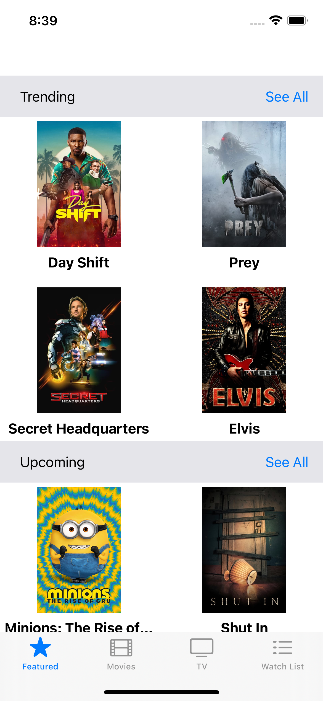
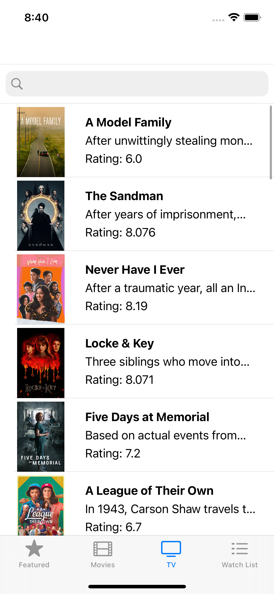
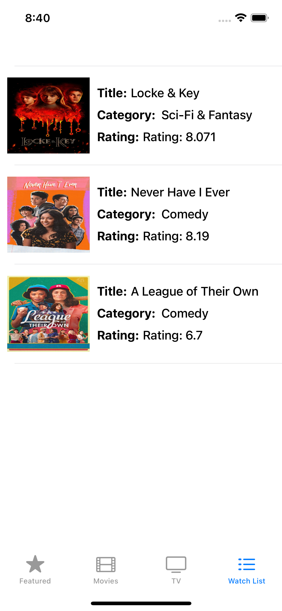

LFMovieApp
==========
LFMovieApp It is an app that presents and allows you to discover TV shows and movies from different categories, and allows you to view an overview and description of the TV show/movie and show user reviews, you can even be saved for later viewing.

## Screenshots

  

    &nbsp;
    &nbsp;
  &nbsp;
   &nbsp;
  &nbsp;

## Important
The API Key is hidden, to use the application you must enter your API Key. if you don’t have a one you can generate a key at <a href="https://developers.themoviedb.org/3/getting-started/introduction" >this link.</a>

After you have KEY insert in NetworkService.swift 
